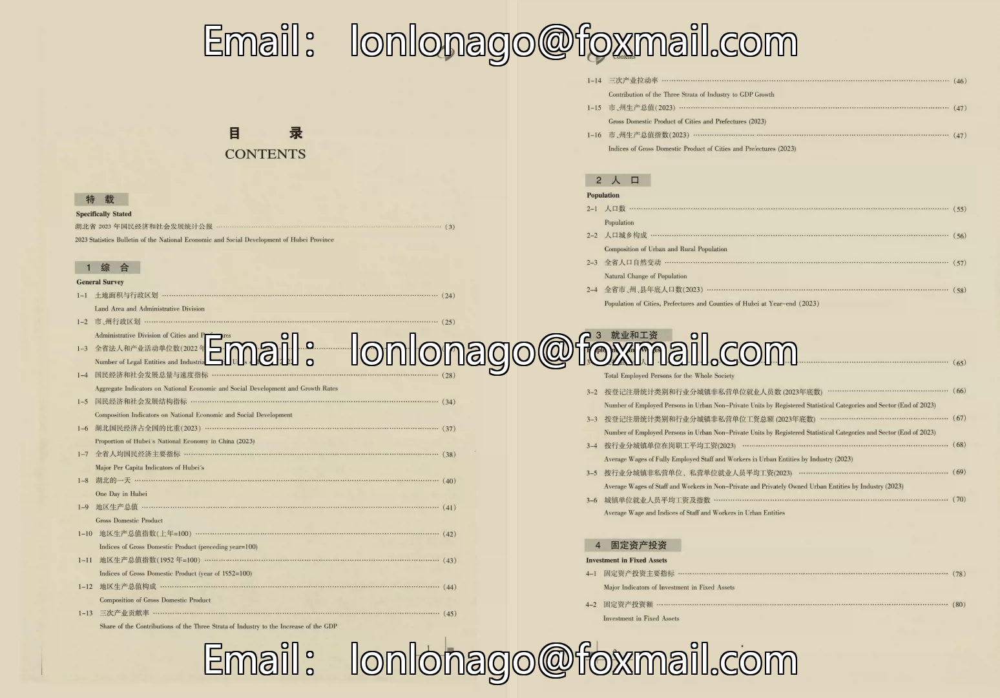
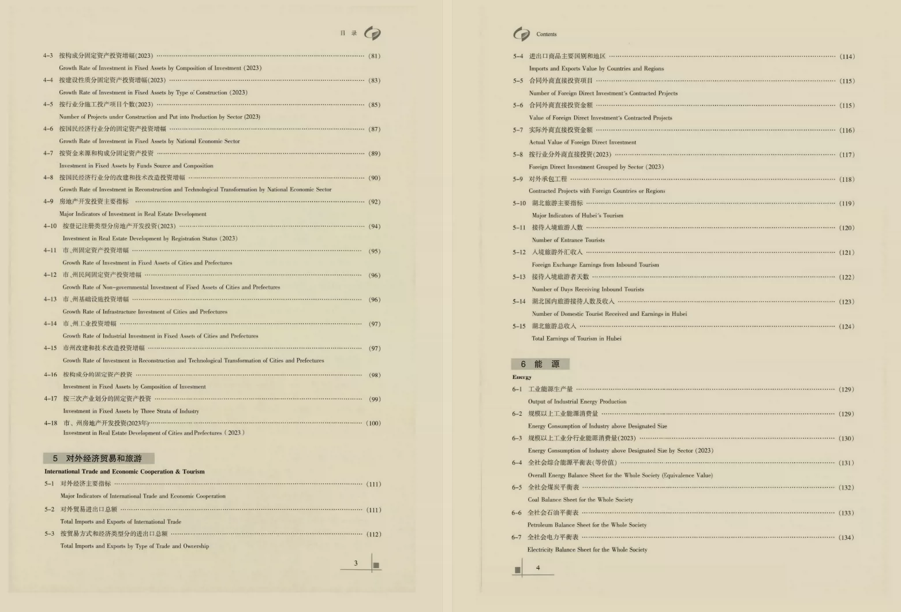
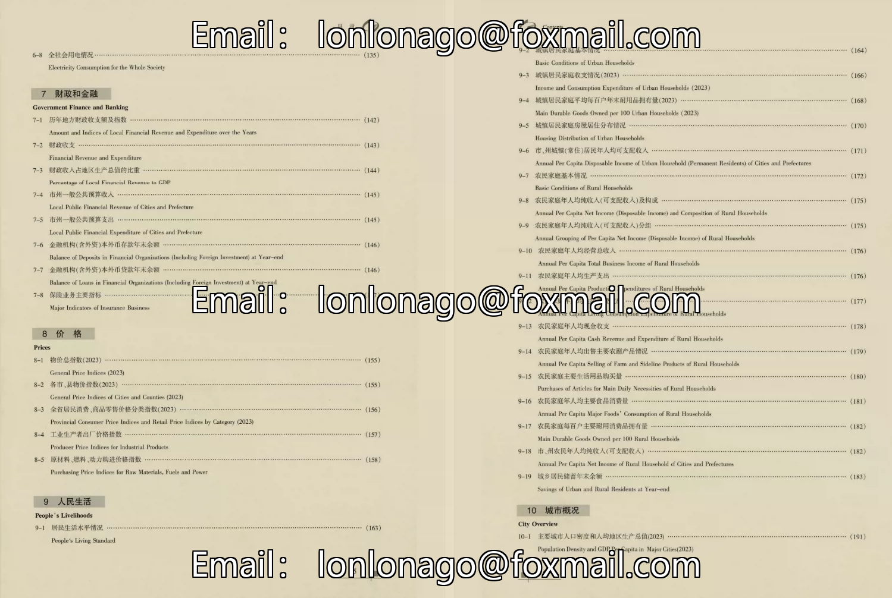
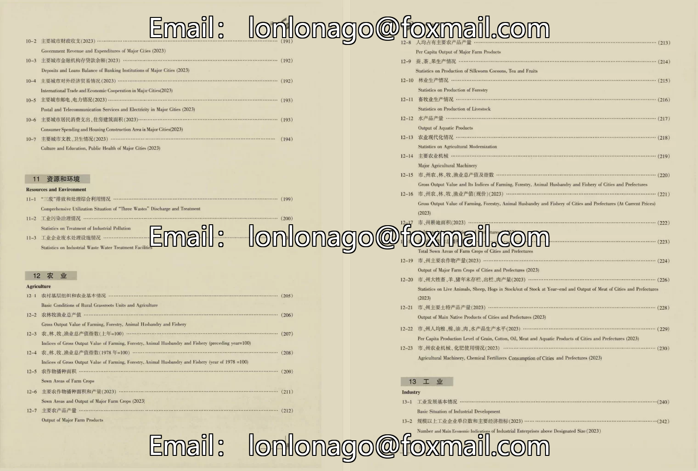
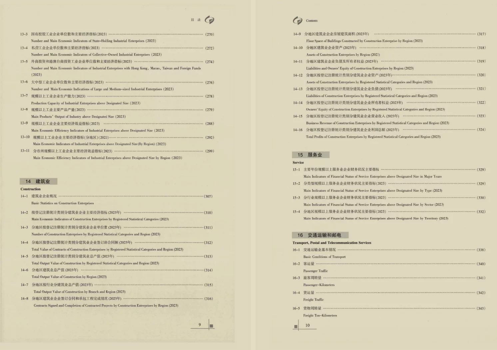
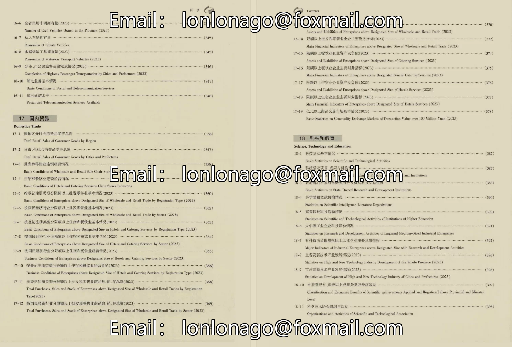
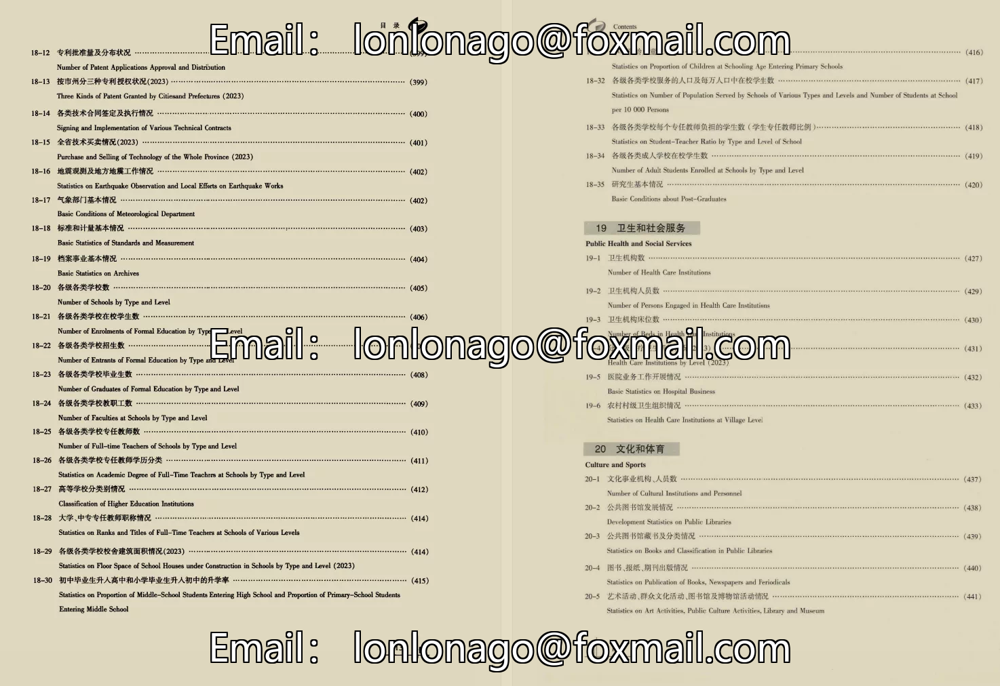
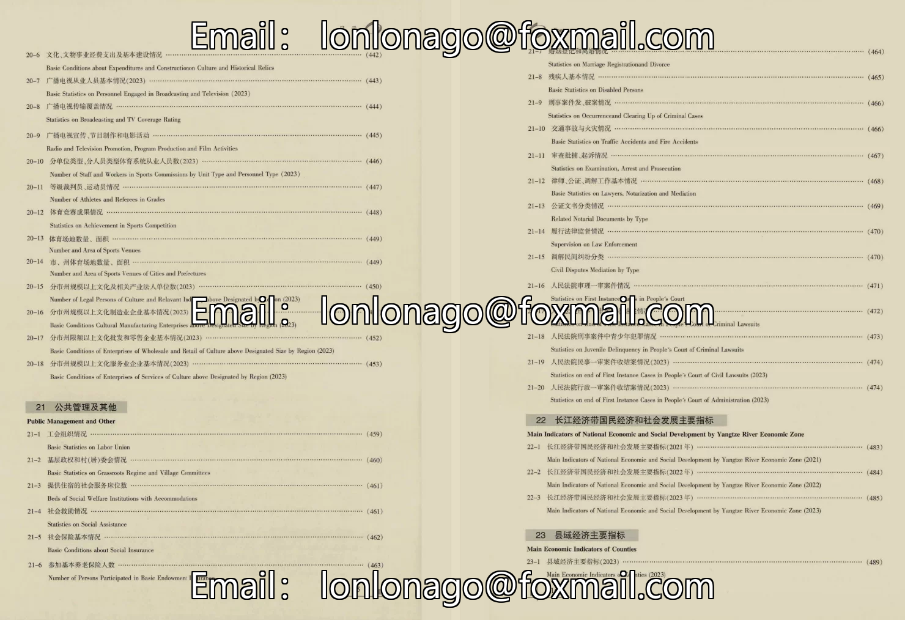

## Body

"Hubei Statistical Yearbook" (1985-2025)

Data Year: The yearbook covers the years from 1985 to 2025, with the actual data year being one less than this.
Hubei Statistical Yearbook [Published Year] 1986 and 1989 are not officially published, please be informed.

01. Data Introduction
The "Hubei Statistical Yearbook"

02. Index Details
The directory is displayed in the picture for reference. Please check it out on your own and purchase accordingly. I cannot help you find the data if you need it. All information is here, but after shipment, we do not support return without reason.
The display directory is for the year 2024, only a few chapters are shown for reference. Different years may have varying statistical criteria, so please be aware of this academic knowledge.

03. Data Format
Format: PDF and Excel, only Excel for 2025.

## Images

Here is a pay link on Stripe ( https://buy.stripe.com/3cs8yP7sY87d0vu9AB ). Please contact me lonlonago@foxmail.com after funding $89, and I will send you a complete data files , thank you!

